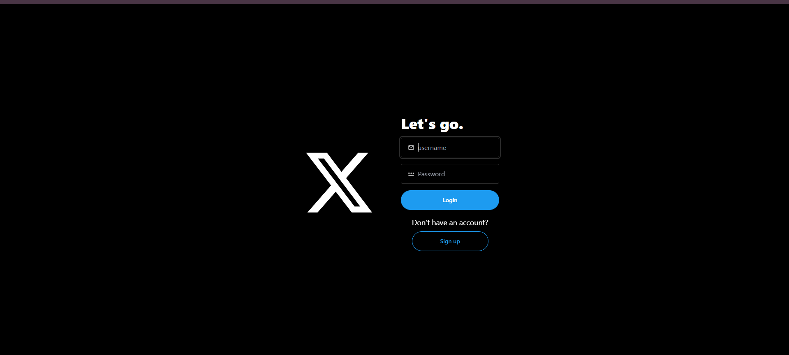
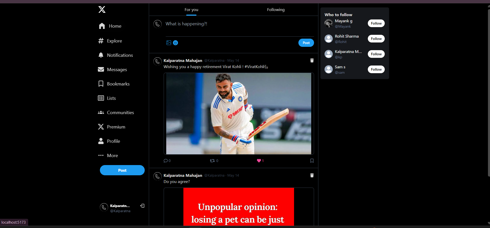
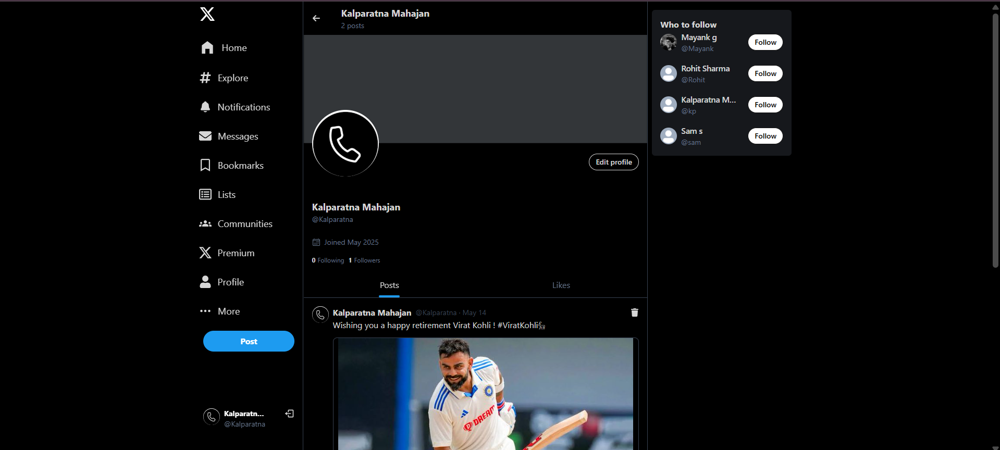
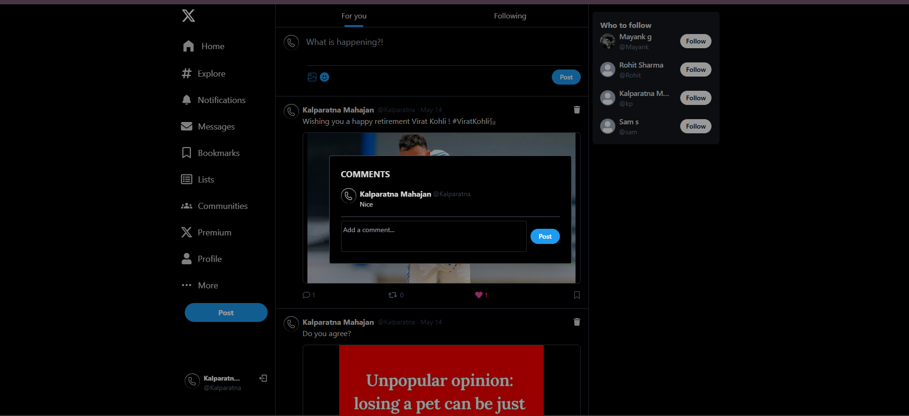
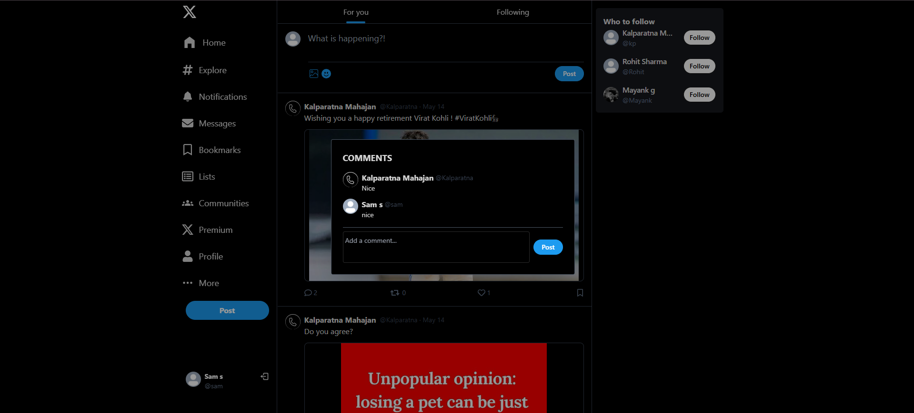
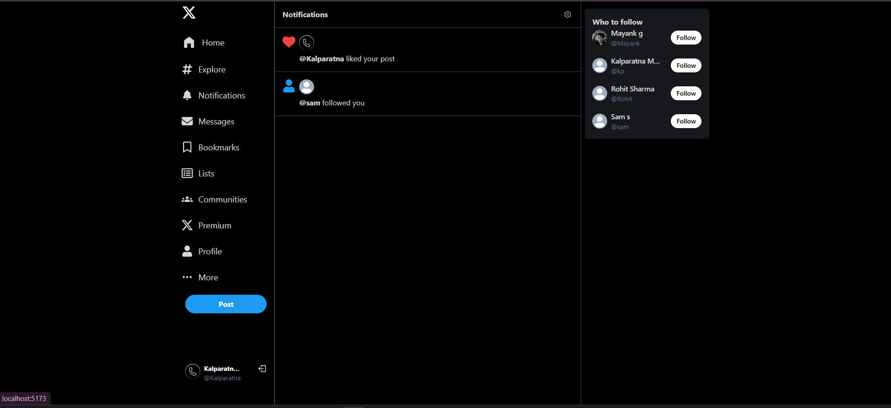
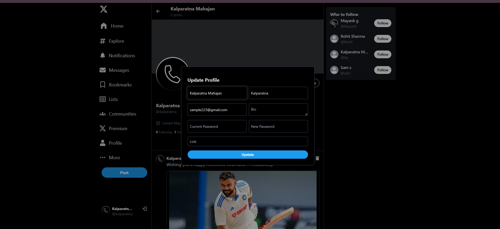
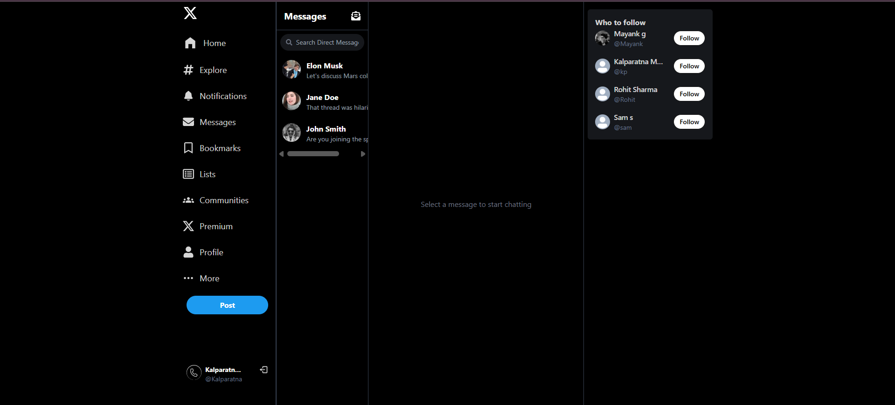
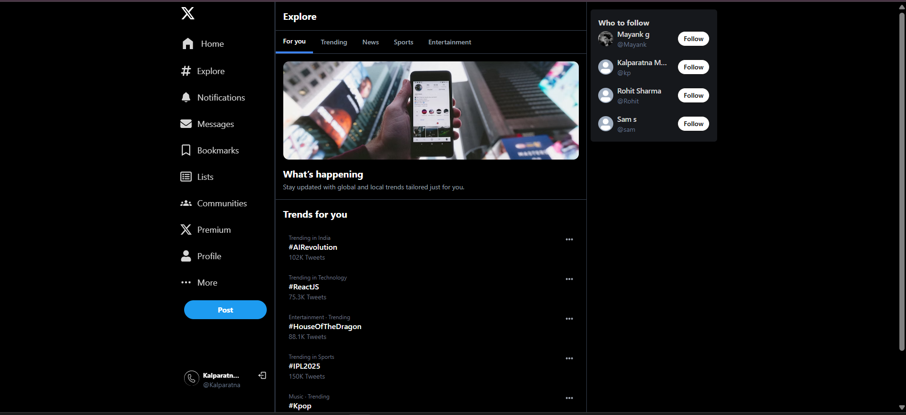
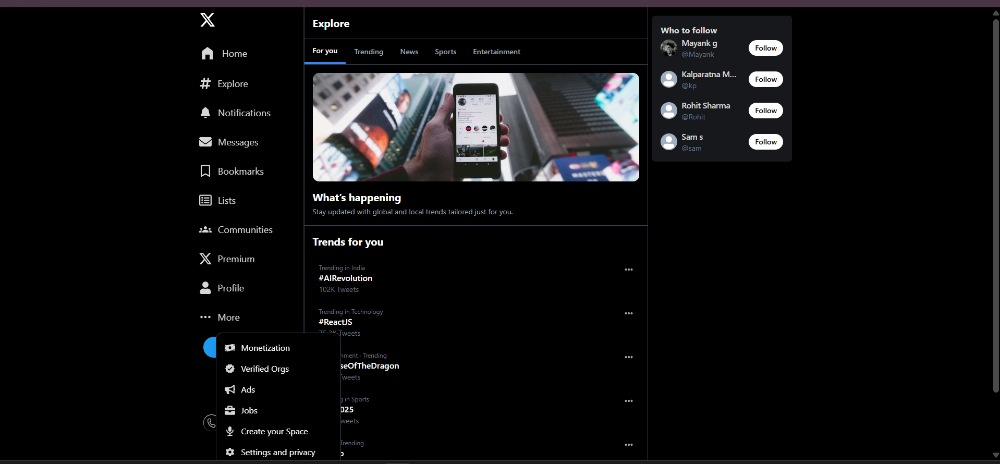

# X (twitter) clone

Full-stack twitter clone using MERN stack, tanstack query (react query), tailwind css & cloudinary. I made this project to practice tanstack query and it turned out to be great!

## 📸 UI Screenshots

<p align="center">
  
  
  
  
  
  
  
  
  
  
</p>


## Run Locally

Clone the project

```bash
  https://github.com/Kalparatna/X-clone-with-Mern.git
```

Install dependencies (first in the root directory for backend/server)

```bash
  npm i
```
Then go to the frontend directory

```bash
  cd frontend
```
Install dependencies for the frontend

```bash
  npm i
```

Start the frontend dev server

```bash
  npm run dev
```

Go back to the root directory

```bash
  cd ..
```

Now start the backend dev server

```bash
  npm run dev
```

**That's it you're done with the setup, now just go and try out the project, Thank you.**
